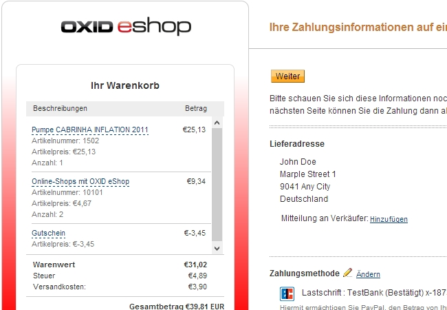

PayPal 6vCommerce 
==========================

Open-Source PayPalmodul für den OXID eShop

Features:

	- Individualisierbare Paypal-Zahlungsseiten (Farbe, Landingpage, Logo, Firmenname,...).
	
	- PayPal-Warenkorb mit detailierter Artikel- und Kostenaufstellung und automatischen B2B-Modus.
	
	- Übermittlung der Lieferadresse, d.h. PayPal-Verkäuferschutz ist verfügbar.
	
	- Bestellnr. und Shopname werden in den PayPal-Emails und im PayPalkonto angezeigt.

	
Anforderungen:

	OXID eShop 4.6, 4.7, 4.8, Azure und OXID Mobile Theme.

Erstinstallation: 

    1. Kopiere den Ordner "modules" im binären Transfermodus in den Hauptordner des Shops.
	
	2. Aktiviere das Modul "6vC PayPal" unter Erweiterungen/Module.
	
	3. In der linken Navigation ist nun der neue Punkt "6vC PayPal-Modul/PayPal Einstellungen" vorhanden.

	4. Klicke dort auf den Installation/Update-Button.
	
	5. Fülle mindestens alle Felder aus, die als Pflichtfeld gekennzeichnet sind und klicke auf "Speichern".
	
	6. Klicke unter Service/Tools auf den Button "VIEWS jetzt updaten".
	
	7. Leere per FTP den Ordner tmp und ab Shopversion 4.7 auch den Ordner tmp/smarty.

	8. Aktiviere die neue Zahlungsart unter Einstellungen/Zahlungsarten und ordne die Benutzergruppen zu (Pflicht!).
	
	9. Ordne PayPal unter Einstellungen/Versandarten den jeweiligen Versandarten zu (Pflicht!).
	
	10. Aktiviere im PayPal-Konto die "Sofortige Zahlungsbestätigung (IPN)" und trage folgende URL ein: http://www.yourwebsite.com/index.php?cl=v6c_hPayPalIpn&v6c_gateway=paypal 
	

Modulupdate: 

    1. Kopiere den Ordner "modules" im binären Transfermodus in den Hauptordner des Shops. Die alten Moduldateien werden überschrieben.
	
	2. Leere per FTP den Ordner tmp und ab Shopversion 4.7 den Ordner tmp/smarty.
	
Licensing: 

	License requires a modest credit to original developer in the form of a link-back (see LICENSE file).
	
Credits: 

	Alexander Pick (ap@pbt-media.com)
	
	eComStyle.de | Josef Andreas Puckl (info@ecomstyle.de)
	
	

		